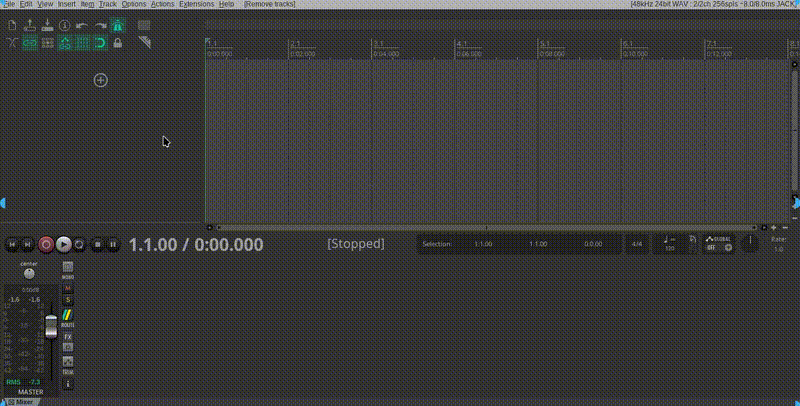

# 🥁 **Real Sigma Drums**

🎶 **Plugin de bateria acústica lv2**, pronto para uso em qualquer DAW compatível com lv2.

Sons reais, multi-mic, round robin e dinâmica natural.



## 📦 **Download**
👉 [**Baixar a última versão**](https://github.com/realsigmamusic/realsigmadrums/releases/latest)

```
realsigmadrums.lv2/
├── manifest.ttl
├── realsigmadrums.ttl
├── realsigmadrums.so
└── sounds.pak
```

## ⚙️ **Instalação (Linux)**
1. Dê permissão de execução ao instalador *(apenas na primeira vez)*:
```bash
chmod +x install.sh
```
2. Execute o instalador:
```bash
./install.sh
```
O plugin será instalado em:
```
~/.lv2/realsigmadrums.lv2/
```

## ⚠️ **Aviso Importante**
Se o plugin for carregado em **modo estéreo simples**, **apenas o bumbo (kick)** será ouvido.
Para escutar todos os instrumentos:

* Use um **host que suporte múltiplas saídas** (multi-out);
* Ative as faixas adicionais do plugin.

## 🎵 Mapeamento MIDI
```
35 Kick
36 Kick
37 Sidestick
38 Snare
40 Snare FX
41 Floortom 3
43 Floortom 2
45 Floortom 1
42 HiHat Closed
44 HiHat Pedal
46 HiHat Open
47 Racktom 3
48 Racktom 2
50 Racktom 1
49 Crash 1
57 Crash 2
51 Ride Bow
53 Ride Bell
59 Ride Edge
52 China
55 Splash
```

## 🧱 **Status do Projeto**
- [x] Plugin lv2
- [x] 16 canais multi-mic
- [x] Round robin
- [x] Samples empacotados em .pak
- [x] Choke groups (hi-hat)
- [x] Curva de velocity
- [x] Samples estéreo nos overheads/room
- [x] Velocity layers
- [x] Linux build
- [ ] Interface gráfica

## 🧠 **Licença**
Distribuído sob a licença **MIT**.
Veja o arquivo `LICENSE` para mais detalhes.

**Desenvolvido por Real Sigma Music**  
🔗 https://github.com/realsigmamusic/realsigmadrums